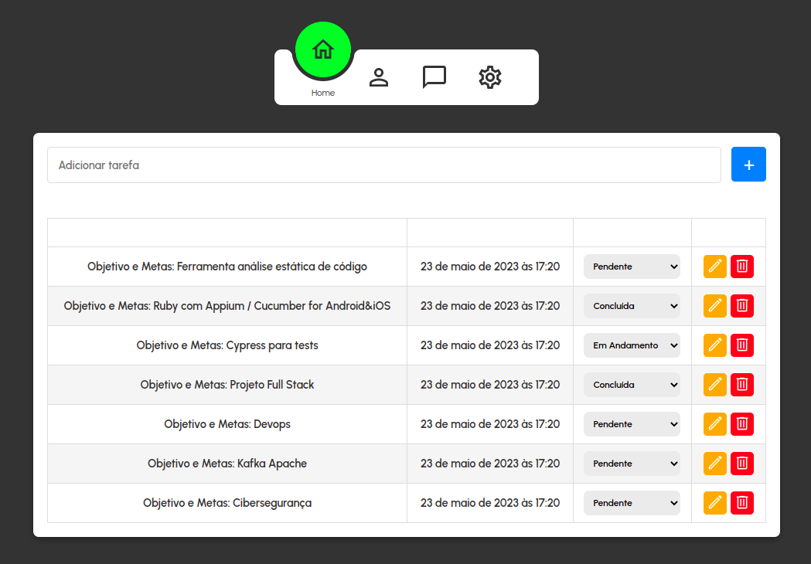
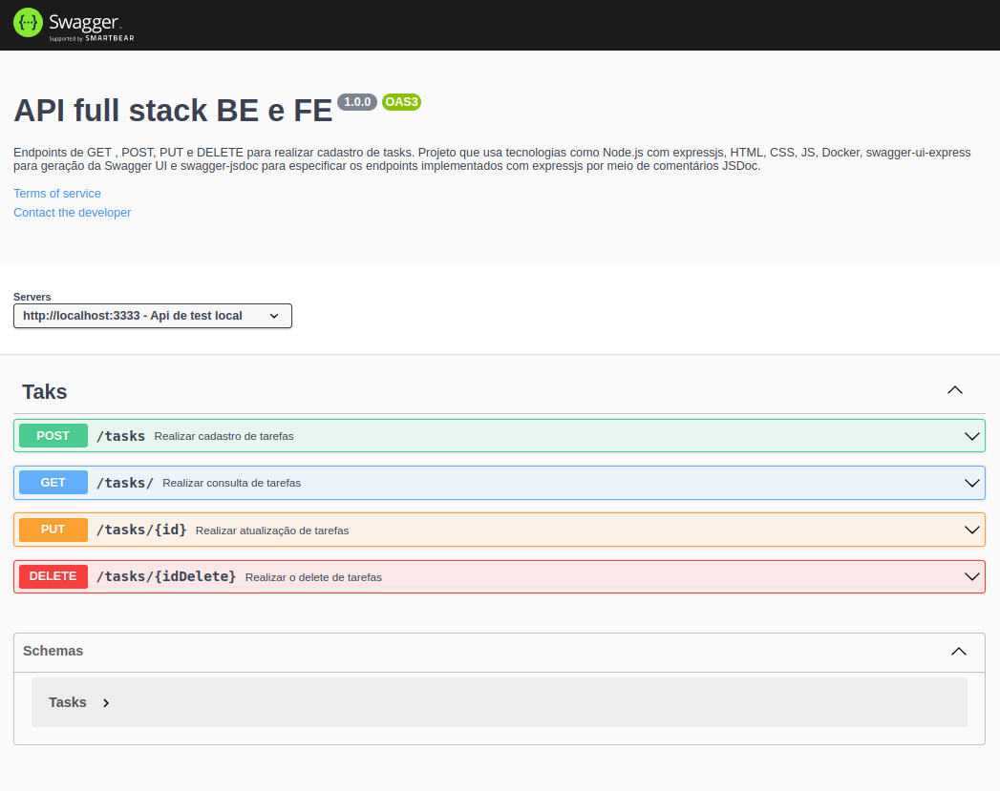

# _api-full-stack-be-fe_

🎯 **API completa usando BE (NodeJS, Express e MySQL) e FE (html, css e javascript)**

## 📁 Estrutura do projeto

-   **backend**

    -   src
        -   controller
            -   **_tasksController.js_** _Realiza as chamadas para a camada model_
        -   middlewares
            -   **_tasksMiddleware.js_** _Validações das requests chamadas no routes_
        -   models
            -   **_connections.js_** _Configuração de conexão com o banco de dados MySQL_
            -   **_tasksModel.js_** _Realiza interação com o banco de dados MySQL_
        -   routes
            -   **_router.js_** _Todas as rotas da aplicação_

    **_app.js_** _Configurações iniciais / core da aplicação_

    **_db-init.js_** _Criação da tabela e inserção inicial_

    **_server.js_** _Inicialização da aplicação_

    **_swagger.json_** _Configurações do Swagger_

    **_.env_** _Variáveis de ambiente_

    **_.eslintrc.json_** _Configurações do plugin de desenvolvimento instalado_

    **_docker-compose.yml_** _Configurações do MySQL para execução no Docker_

    **_Dockerfile_** _Configurações do ambiente Dockerizado_

    **_package-lock.json_** _Gerado automaticamente conforme package.json_

    **_package.json_** _Dependências do projeto_

    **_TASKS.postman_collection.json_** _Arquivo de importação do Postman_

-   **frontend**

    -   css
        -   **_style.css_** _Estilo da página_
    -   js
        -   **_script.js_** _Funções de comportamento e chamadas para o backend_

    **_index.html_** _página principal da aplicação_

---

## 🔨 Pré-requisitos

-   [npm](https://docs.npmjs.com/downloading-and-installing-node-js-and-npm)
-   [node](https://nodejs.org/en/download)
-   [Docker](https://docs.docker.com/engine/)
-   Extensões Vscode
    -   [Docker](https://marketplace.visualstudio.com/items?itemName=ms-azuretools.vscode-docker)
    -   [Database Server](https://marketplace.visualstudio.com/items?itemName=cweijan.vscode-database-client2)
    -   [Live Server](https://github.com/ritwickdey/vscode-live-server-plus-plus)

## ⚙ Comandos

Iniciar nossa aplicação gerando info padrão (_Opcional para desenvolvimento do projeto_)

> npm init -y

Instalar dependencias (_Obrigatório_)

> npm install express

> npm install mysql2

> npm install nodemon

> npm install dotenv

> npm install cors

> npm install swagger-jsdoc swagger-ui-express

> npm install swagger-ui-express

Instalar eslint (_Obrigatório para desenvolvimento_)

> npx eslint --init

**_Deixar o código mais limpo e ajudar no desenvolvimento_**

-   Need to install the following packages: eslint@8.41.0
    -   Ok to proceed? (y) y
-   You can also run this command directly using 'npm init @eslint/config'. Need to install the following packages > @eslint/create-config@0.4.3
    -   Ok to proceed? (y) y
-   ✔ How would you like to use ESLint? · style
-   ✔ What type of modules does your project use? · commonjs
-   ✔ Which framework does your project use? · none
-   ✔ Does your project use TypeScript? · No / Yes
-   ✔ Where does your code run? · node
-   ✔ How would you like to define a style for your project? · prompt
-   ✔ What format do you want your config file to be in? · JSON
-   ✔ What style of indentation do you use? · 4
-   ✔ What quotes do you use for strings? · single
-   ✔ What line endings do you use? · unix
-   ✔ Do you require semicolons? · No / Yes
-   ✔ Would you like to install them now? · No / Yes
-   ✔ Which package manager do you want to use? · npm

✔ Installing eslint@latest

Rodar nosso server local direto (_Opcional para desenvolvimento_)

> node src/index.js

Após adicionar a task de dev (_Opcional para desenvolvimento_)

> npm run dev

Subir pela primeira vez o container do mysql usando o docker (_Opcional para desenvolvimento_)

> docker run --name mysql -e MYSQL_ROOT_PASSWORD=root -p 3306:3306 -d mysql

Ver imagens Docker (_Opcional_)

> docker image list

Subir a imagem do mysql manualmente (_Opcional_)

> docker start mysql

Caso alguma porta local esteja sendo utiliza podemos usar esses comando para listar e finalizar o processo

> lsof -i :3000

> kill -9 PID

## 🛠️ Executar Projeto

#### Subir camada de BE local (diretório _/backend_)

> npm start

**_Este comando starta automaticamente todo o ambiente_**

-   Docker com a imagem do mysql
-   Cria a tabela e realiza a carga inicial no BD
-   Server do app
-   Server do Swagger
    -   http://127.0.0.1:3000/api-docs/

Tag Debug

> npm run start:debug

---

#### **Open aplicação (diretório _/frontend_)**

-   Start utilizando o plugin Live Server do vscode
    > http://127.0.0.1:5500/frontend/index.html
-   Ou abrindo o arquivo
    > /api-full-stack-be-fe/frontend/index.html

---

Importar requests no postman para utilização das chamadas de BE.

-   Arquivo na raiz do projeto **backend/postman_collection.json**

## 🔗 Links adicionais

-   [FE - Material Google](https://fonts.google.com/icons)
-   [FE - Icons](https://ionic.io/ionicons)
-   [BE - Swagger](https://swagger.io/specification/)
-   [BE - Swagger Json Example](https://petstore.swagger.io/v2/swagger.json)

## 📚 To-do

-   Add consulta por ID
